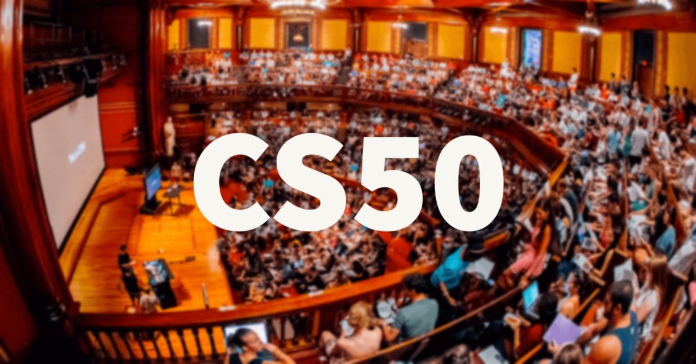

{{center}}

# 🗺 {{project_name}} {{emoji_path}}/Activities/1st%20Place%20Medal.png" alt="Glowing Star{{emoji_end}}

**This roadmap provides a structured guide for beginners to explore computer science fundamentals. The resources included are personal recommendations. Feel free to choose your own path as you learn and grow!** {{emoji_path}}/Food/Hot%20Beverage.png" alt="Hot Beverage{{emoji_end}}

---

## **Edited Version**

This roadmap was created by [{{author_name}}]({{author_github}}).  
And this is the original [roadmap]({{author_github}}/Computer-Science-Fundamentals-Roadmap).  
This is an **edited** version reflecting my own thoughts and additions to the roadmap.  
Alright then... Enjoy {{emoji_path}}/Travel%20and%20places/Fire.png" alt="Fire{{emoji_end}}

---

For translation:  
[English](https://github.com/kady-x/Computer-Science-Fundamentals-Roadmap/blob/main/README.md) | [عربي](https://github.com/kady-x/Computer-Science-Fundamentals-Roadmap/blob/main/README_AR.md)

---

## {{emoji_path}}/Objects/Books.png" alt="Books{{emoji_end}} Table of Contents

- [Introduction to Computer Science](#introduction-to-computer-science-)  
- [Choose a Programming Language](#choose-a-programming-language-)  
- [Object-Oriented Programming (OOP)](#object-oriented-programming-oop-)  
- [Data Structures and Algorithms](#data-structures-and-algorithms-)  
- [Databases](#databases-)  
- [Operating Systems (OS)](#operating-systems-os-)  
- [Problem-Solving (Practice From Day One)](#problem-solving-practice-from-day-one-)  
- [Version Control](#version-control-)  
- [Choose Your Path](#choose-your-path-)

---

### Content

## Introduction to Computer Science {{emoji_path}}/People/Student.png" alt="Student Icon{{emoji_end}}

> **Note:** Choose the course that best aligns with your interests and learning style. Each of these courses will provide you with a solid foundation in computer science.

### CS50: Introduction to Computer Science (Preferred)

This is Harvard University's introduction to the intellectual enterprises of computer science and the art of programming. The course teaches students how to think algorithmically and solve problems efficiently. Topics include abstraction, algorithms, data structures, encapsulation, resource management, security, software engineering, and web development. Languages include C, Python, and SQL plus HTML, CSS, and JavaScript.

<table>
  <tr>
    <td>
      
    </td>
    <td>
      <ul>
        <li><a href="https://www.edx.org/learn/computer-science/harvard-university-cs50-s-introduction-to-computer-science">CS50: Introduction to Computer Science</a></li>
        <li><a href="https://www.youtube.com/playlist?list=PLknwEmKsW8OvMsFbU9zo8oJCprAsgc4LO">CS50 In Arabic</a></li>
      </ul>
    </td>
  </tr>
</table>

### MITx: Introduction to Computer Science and Programming Using Python

This is an introductory course in computer science that uses Python as the primary language. The course covers basic concepts such as algorithms, data structures, and computational thinking. It's a great starting point for anyone new to programming and computer science.

<table>
  <tr>
    <td>
      
    </td>
    <td>
      <ul>
        <li><a href="https://www.edx.org/learn/computer-science/massachusetts-institute-of-technology-introduction-to-computer-science-and-programming-using-python">Introduction to Computer Science and Programming Using Python</a></li>
      </ul>
    </td>
  </tr>
</table>

[🔝 Back to Top](#-table-of-contents) | [➡️ Next Section](#choose-a-programming-language-)

---

## Choose a Programming Language {{emoji_path}}/Smilies/Robot.png" alt="Robot{{emoji_end}}

> After completing the Introduction to Computer Science, it's time to dive deeper into a specific programming language. Below are resources for both Java and C++. Choose only **one** to focus on—the main difference between these languages is their syntax, so the concepts you learn will be applicable in either case.

| **Language/Type** | **Resource** | **Link** |
|--------------|--------------|----------|
| **English / Java** | Java Tutorial for Beginners - Crash Course | [Watch Here](https://youtu.be/eIrMbAQSU34?si=0fuf36q7lrjGieo8) |
| **English / Java**  | Java Programming for Beginners - FreeCodeCamp Crash Course | [Watch Here](https://youtu.be/A74TOX803D0?si=1rQQWSE_7VreRVtw) |
| **Arabic / Java**   | Learn JAVA Programming From Scratch In Arabic - Adel Nasim | [Watch Here](https://youtube.com/playlist?list=PLCInYL3l2AajYlZGzU_LVrHdoouf8W6ZN&si=86pJLYf_qGPv2gyE) |
| **Arabic / Java**   | Java Programming For Beginners - Course 1- بالعربى - Dr.Mohamed El Desouky | [Watch Here](https://youtube.com/playlist?list=PL1DUmTEdeA6K7rdxKiWJq6JIxTvHalY8f&si=wBnqFpgvpg9MrdCr) |
| **Arabic / Java**   | Java - بالعربي - Omar Ahmed | [Watch Here](https://youtube.com/playlist?list=PLwWuxCLlF_ucgIJOLT2KH5aQ9tt-sXyQ9&si=x1maTfUXmC4US8xC) |
| **Tutorials / Java**| Java Documentation - Oracle | [Read Here](https://docs.oracle.com/en/java/) |
| **Tutorials / Java**| Java Tutorial - W3Schools | [Read Here](https://www.w3schools.com/java) |
| **Tutorials / Java**| Java Tutorial - Javatpoint | [Read Here](https://www.javatpoint.com/java-tutorial) |
| **Tutorials / Java**| Java Tutorial - Tutorialspoint | [Read Here](https://www.tutorialspoint.com/java) |
| **Tutorials / Java**| Java Tutorial - GeeksforGeeks | [Read Here](https://www.geeksforgeeks.org/java/) |
| &nbsp;       | &nbsp;       | &nbsp;   |
| **English / C++**  | C++ Tutorial for Beginners - FreeCodeCamp Crash Course | [Watch Here](https://youtu.be/vLnPwxZdW4Y?si=do7-JVxyq7LBUqVG) |
| **English / C++**  | C++ Programming Course - Beginner to Advanced - FreeCodeCamp full course in one video | [Watch Here](https://youtu.be/8jLOx1hD3_o?si=8xnUkbi8XO-mvlq0) |
| **Arabic / C++**   | CPP for beginners - سي بلس للمبتدئين - Dr Mustafa Saad | [Watch Here](https://youtube.com/playlist?list=PLPt2dINI2MIbwnEoeHZnUHeUHjTd8x4F3&si=iwgxMvbTw4lauDfb) |
| **Arabic / C++**   | Fundamentals Of Programming With C++ - Elzero Web School | [Watch Here](https://youtube.com/playlist?list=PLDoPjvoNmBAwy-rS6WKudwVeb_x63EzgS&si=Pw-zeMW-cssGLEkL) |
| **Arabic / C++**   | Learn C++ Programming From Scratch In Arabic - Adel Nasim | [Watch Here](https://youtube.com/playlist?list=PLCInYL3l2AajFAiw4s1U4QbGszcQ-rAb3&si=16vIfd0OwKqpUTLe) |
| **Arabic / C++**   | programming 1 - Programming For Beginners - C++ عربى - Dr.Mohamed El Desouky | [Watch Here](https://youtube.com/playlist?list=PL1DUmTEdeA6IUD9Gt5rZlQfbZyAWXd-oD&si=gJ-SAIWXU60ljRbC) |
| **Tutorials / C++**| C++ Tutorial - W3Schools | [Read Here](https://www.w3schools.com/cpp) |
| **Tutorials / C++**| C++ Tutorial - Javatpoint | [Read Here](https://www.javatpoint.com/cpp-tutorial) |
| **Tutorials / C++**| C++ Tutorial - Tutorialspoint | [Read Here](https://www.tutorialspoint.com/cplusplus) |
| **Tutorials / C++**| C++ Tutorial - GeeksforGeeks | [Read Here](https://www.geeksforgeeks.org/c-plus-plus) |

[🔝 Back to Top](#-table-of-contents) | [➡️ Next Section](#object-oriented-programming-oop-)

---

## Object Oriented Programming (OOP) {{emoji_path}}/Smilies/Alien%20Monster.png" alt="Alien Monster{{emoji_end}}

> Learn the various programming paradigms, with a strong focus on Object-Oriented Programming (OOP).

| **Language/Type** | **Resource** | **Link** |
|-------------------|--------------|----------|
| **English / Java**    | Full Java Course by Alex Lee - From video 71 | [Watch Here](https://www.youtube.com/playlist?list=PL59LTecnGM1NRUyune3SxzZlYpZezK-oQ) |
| **Arabic / Java**     | Object-Oriented Programming JAVA in Arabic - Adel Nasim | [Watch Here](https://youtube.com/playlist?list=PLCInYL3l2AagY7fFlhCrjpLiIFybW3yQv&si=ffwN6Pv4c7bk9RBC) |
| **Arabic / Java**     | Programming 2 - Object Oriented Programming With Java - Dr.Mohamed El Desouky | [Watch Here](https://youtube.com/playlist?list=PL1DUmTEdeA6Icttz-O9C3RPRF8R8Px5vk&si=7aYe_yLppyu_wJon) |
| **Arabic / Java**     | OOP - بالعربي - Omar Ahmed | [Watch Here](https://youtube.com/playlist?list=PLwWuxCLlF_ue7GPvoG_Ko1x43tZw5cz9v&si=FD1ZbGIa64hf6nBw) |
| &nbsp;            | &nbsp;       | &nbsp;   |
| **English / C++**     | Object Oriented Programming (OOP) in C++ Course - FreeCodeCamp Crash Course | [Watch Here](https://youtu.be/wN0x9eZLix4?si=nJYhSnegkQLfl9r0) |
| **Arabic / C++**      | C++ Object-Oriented Design and Programming - Dr. Mustafa Saad | [Watch Here](https://youtube.com/playlist?list=PLPt2dINI2MIbMba7tpx3qvmgOsDlpITwG&si=JhCD8nN7pDcn5s-G) |
| **Arabic / C++**     | Object-Oriented Programming C++ in Arabic - Adel Nasim | [Watch Here](https://youtube.com/playlist?list=PLCInYL3l2Aaiq1oLvi9TlWtArJyAuCVow&si=b8zjSYQd7HoeMT0N) |
| **Arabic / C++**      | Programming 2 - Object Oriented Programming with C++ - Dr.Mohamed El Desouky | [Watch Here](https://youtube.com/playlist?list=PL1DUmTEdeA6KLEvIO0NyrkT91BVle8BOU&si=1d91-1biDzNIkQUl) |
| &nbsp;            | &nbsp;       | &nbsp;   |
| **Book**              | Head First Object-Oriented Analysis and Design | [Read Here](https://drive.google.com/file/d/125gh8BrCMnhjusOkHmC0-pC84pGbPyjF/view?usp=drive_link) |
| **Book**              | Head First Design Patterns | [Read Here](https://drive.google.com/file/d/17ow6nRzxuiUic756jKf2g3Pv4HrqouXP/view?usp=drive_link) |

[🔝 Back to Top](#-table-of-contents) | [➡️ Next Section](#data-structures-and-algorithms-)

---

## Data Structures and Algorithms {{emoji_path}}/Objects/Card%20File%20Box.png" alt="Card File Box{{emoji_end}}

> Don’t just memorize how a data structure works — understand why it exists and when to use it.

| **Language/Type** | **Resource** | **Link** |
|-------------------|--------------|----------|
| **English**           | Data Structures and Algorithms with Visualizations - FreeCodeCamp Full Course | [Watch Here](https://www.youtube.com/watch?v=2ZLl8GAk1X4) |
| **English**           | Graph Algorithms for Technical Interviews  - FreeCodeCamp | [Watch Here](https://youtu.be/tWVWeAqZ0WU?si=36_dfYXbKG1GgCWM) |
| &nbsp;            | &nbsp;       | &nbsp;   |
| **Arabic**            | Data Structures Full Course In Arabic - Adel Nasim | [Watch Here](https://youtube.com/playlist?list=PLCInYL3l2AajqOUW_2SwjWeMwf4vL4RSp&si=ggqXcs1kHUrENDAB) |
| **Arabic**            | C++ Data Structures - تراكيب البيانات -  Dr.Mohamed El Desouky | [Watch Here](https://youtube.com/playlist?list=PL1DUmTEdeA6JlommmGP5wicYLxX5PVCQt&si=UYLt23C2Igz3Amnd) |
| **Arabic**            | Data Structures - Dr. Mustafa Saad | [Watch Here](https://youtube.com/playlist?list=PLPt2dINI2MIZX2EtY81WI-lDkvhKziLKM&si=NqoNh2LytCe8Eb60) |
| &nbsp;            | &nbsp;       | &nbsp;   |
| **Book**              | Grokking Algorithms | [Read Here](https://drive.google.com/file/d/1OhcZyamaofsFDszf0GbmHOAFtxzOX-f8/view?usp=drive_link) |
| **Book**              | Algorithms Unplugged | [Read Here](https://drive.google.com/file/d/1W1W_JUYOuZ5gtCed6y2Hv4ZPEpGMsng1/view?usp=drive_link) |

[🔝 Back to Top](#-table-of-contents) | [➡️ Next Section](#databases-)

---

## Databases {{emoji_path}}/Objects/Package.png" alt="Database{{emoji_end}}

> Don’t just learn SQL syntax — **understand how data connects** and how to **design schemas** that reflect real-world logic.

| **Language/Type** | **Resource** | **Link** |
|-------------------|--------------|----------|
| **English**           | Introduction to Databases with SQL - CS50 | [Watch Here](https://cs50.harvard.edu/sql/2024/) |
| **English**           | SQL Tutorial - Full Database Course for Beginners - FreeCodeCamp Crash Course | [Watch Here](https://youtu.be/HXV3zeQKqGY?si=HE-mwX5mSE3m0Ccv) |
| &nbsp;            | &nbsp;       | &nbsp;   |
| **Arabic**            | Database 1 - Fundamentals of Database Systems - Dr.Mohamed El Desouky | [Watch Here](https://youtube.com/playlist?list=PL37D52B7714788190&si=VGHd_wgOvTHKLEir) |
| **Arabic**            | ITI Material | [Read Here](https://drive.google.com/drive/folders/136jCVW9dISvw-SFjnRklPh1YEzbeS025) |
| **Arabic**            | Database Fundamentals - MaharaTech | [Read Here](https://maharatech.gov.eg/course/view.php?id=740) |
| **Arabic**            | Database Management Systems Course - 2nd Database Course (*Advanced*) - Dr.Mohamed El Desouky | [Watch Here](https://youtube.com/playlist?list=PL1DUmTEdeA6Lg6CXlnxEDhwpmWB0QaDh5&si=VkPT9rFNZpkyWDew) |
| **Arabic**            | Relational Database Internals Arabic (*Advanced*) | [Watch Here](https://youtube.com/playlist?list=PLE8kQVoC67PzGwMMsSk3C8MvfAqcYjusF&si=gbn5kX2CT3rp33WF) |
| &nbsp;            | &nbsp;       | &nbsp;   |
| **Book**              | Fundumentals Of Database Systems | [Read Here](https://drive.google.com/file/d/1JwJDWIbMhBU8DoMLUc0C0oXBuwqq5wW0/view?usp=drive_link) |

[🔝 Back to Top](#-table-of-contents) | [➡️ Next Section](#operating-systems-os-)

---

## Operating Systems (OS) {{emoji_path}}/Objects/Gear.png" alt="OS{{emoji_end}}

>To not get overwhelmed, think of the OS as a system managing resources, one layer at a time: memory, processes, files, and hardware.

| **Language/Type** | **Resource** | **Link** |
|-------------------|--------------|----------|
| **English**           | Operating Systems: Three Easy Pieces (OSTEP) - CMU | [Watch Here](https://youtube.com/playlist?list=PLRJWiLCmxyxi2RCPVYfewxJIWJzc_colw&si=z-qv7FdvltL24Jqs) |
| **English**           | Operating Systems Course for Beginners - FreeCodeCamp Course | [Watch Here](https://youtu.be/yK1uBHPdp30?si=0Dxg8UjKlZDBwgzu) |
| **English**           | Operating System - Neso Academy | [Watch Here](https://youtube.com/playlist?list=PLBlnK6fEyqRiVhbXDGLXDk_OQAeuVcp2O&si=8kTi59gtlRk-s4Wm) |
| &nbsp;            | &nbsp;       | &nbsp;   |
| **Arabic**            | ITI Material | [Watch Here](https://youtube.com/playlist?list=PLtHXR6eHeKvs9YsgFcqgUAqM4zaMjVOvj&si=2TW5a6aGa5JWCNQx) |
| **Arabic**            | Operating Systems - أنظمة التشغيل - Dr. Ahmed Hagag | [Watch Here](https://www.youtube.com/playlist?list=PLxIvc-MGOs6ib0oK1z9C46DeKd9rRcSMY) |
| &nbsp;            | &nbsp;       | &nbsp;   |
| **Book**              | Introduction to operating system design and implementation | [Read Here](https://drive.google.com/file/d/1WjZIN4CNzcIfC5tPFDjfydgAVgrl9M7S/view?usp=drive_link) |

[🔝 Back to Top](#-table-of-contents) | [➡️ Next Section](#problem-solving-practice-from-day-one-)

---

## Problem-Solving (Practice From Day One) {{emoji_path}}/Hand%20gestures/Brain.png" alt="Problem solving{{emoji_end}}

> Big problems are just small problems glued together.
Train yourself to divide and conquer — identify patterns, isolate constraints, and solve step by step.

| **Type** | **Resource** | **Link** |
|----------|--------------|----------|
| **Training Plan** | ICPC Al-azhar | [View Here](https://sites.google.com/view/azharicpc/training-plans/level-1-training21) |
| **Training Plan** | ICPC Assiut | [View Here](https://docs.google.com/spreadsheets/d/1EbbsotAwb0zuuwxyzs8l2qh8twqw-sNcNbAjCK1kXaE/edit?usp=drivesdk) |
| &nbsp;            | &nbsp;       | &nbsp;   |
| **Sheet**         | Competitions sheet - Dr. Mustafa Saad | [View Here](https://docs.google.com/spreadsheets/d/1iJZWP2nS_OB3kCTjq8L6TrJJ4o-5lhxDOyTaocSYc-k/edit?gid=84654839#gid=84654839) |
| **Sheet**         | Interviews Sheet sheet - Dr. Mustafa Saad | [View Here](https://docs.google.com/spreadsheets/d/1ClmoHFMqQKOHinRhrId42sbofQ0T0IyaFzZcEcVvXbU/edit?gid=593476609#gid=593476609) |
| &nbsp;            | &nbsp;       | &nbsp;   |
| **Platform**      | LeetCode | [Visit](https://leetcode.com/) |
| **Platform**      | NeetCode | [Visit](https://neetcode.io/practice) |
| **Platform**      | NeetCode (YouTube) | [Visit](https://www.youtube.com/@NeetCode/playlists) |
| **Platform**      | HackerRank | [Visit](https://www.hackerrank.com/) |

[🔝 Back to Top](#-table-of-contents) | [➡️ Next Section](#version-control-)

---

## Version Control {{emoji_path}}/Animals/Deciduous%20Tree.png" alt="Version Control{{emoji_end}}

>Git doesn’t store **diffs** (file-by-file changes), it stores **snapshots** of your entire project at each commit.
Understanding this mental model changes **how you use Git** — and helps avoid fear or confusion with commands like `revert`, `reset`, `rebase`, and `merge`.

| **Language** | **Resource** | **Link** |
|--------------|--------------|----------|
| **English**      | Git and GitHub for Beginners- FreeCodeCamp Crash Course | [Watch Here](https://youtu.be/RGOj5yH7evk?si=6pN3oFWDmtPQ3EVF) |
| &nbsp;            | &nbsp;       | &nbsp;   |
| **Arabic**       | Git and GitHub شخبط وانت متطمن - Crash Course | [Watch Here](https://youtu.be/Q6G-J54vgKc?si=hVMcqE0GXsi_f8tD) |
| **Arabic**       | Learn Git and Github - Elzero Web School | [Watch Here](https://www.youtube.com/playlist?list=PLDoPjvoNmBAw4eOj58MZPakHjaO3frVMF) |

[🔝 Back to Top](#-table-of-contents) | [➡️ Next Section](#choose-your-path-)

---

## Choose Your Path {{emoji_path}}/Animals/Deciduous%20Tree.png" alt="Version Control{{emoji_end}}

Before diving into a specific career path, ensure you have a strong foundation in the following topics:

### **Foundational Topics**
- [Algorithms and Data Structures](#data-structures-and-algorithms)
- [Problem-Solving](#problem-solving-practice-from-day-one)
- [Version Control](#version-control)
- [Basic Programming Concepts](#choose-a-programming-language)

---

<b>Frontend Development</b> 

### **Frontend Development Roadmap**
1. **Learn the Basics**:
   - HTML, CSS, JavaScript
   - Responsive Design (Flexbox, Grid)
2. **Frameworks**:
   - React.js, Angular, Vue.js
3. **Tools**:
   - Webpack, Babel, NPM/Yarn
4. **Advanced Topics**:
   - State Management (Redux, Context API)
   - Progressive Web Apps (PWAs)

#### Resources:
- [HTML & CSS Crash Course](https://youtu.be/mU6anWqZJcc)
- [JavaScript for Beginners](https://youtu.be/W6NZfCO5SIk)
- [React.js Documentation](https://reactjs.org/docs/getting-started.html)
=

---

<b>Backend Development</b> 

### **Backend Development Roadmap**
1. **Learn a Programming Language**:
   - Python, Java, Node.js
2. **Databases**:
   - SQL (MySQL, PostgreSQL)
   - NoSQL (MongoDB, Firebase)
3. **Frameworks**:
   - Django, Flask, Express.js
4. **Advanced Topics**:
   - REST APIs, GraphQL
   - Authentication (OAuth, JWT)

#### Resources:
- [Python for Beginners](https://youtu.be/_uQrJ0TkZlc)
- [Django Documentation](https://docs.djangoproject.com/en/4.0/)
- [Node.js Crash Course](https://youtu.be/fBNz5xF-Kx4)
=

---

<b>App Development</b> 

### **App Development Roadmap**
1. **Mobile Development**:
   - Flutter, React Native, Swift, Kotlin
2. **Desktop Development**:
   - Electron, Qt
3. **Advanced Topics**:
   - App Deployment (Play Store, App Store)
   - Performance Optimization

#### Resources:
- [Flutter Documentation](https://flutter.dev/docs)
- [React Native Crash Course](https://youtu.be/0-S5a0eXPoc)
- [Kotlin for Beginners](https://youtu.be/F9UC9DY-vIU)

---

<b>Data Science/AI</b> 

### **Data Science/AI Roadmap**
1. **Programming Languages**:
   - Python, R
2. **Libraries**:
   - NumPy, Pandas, TensorFlow, PyTorch
3. **Advanced Topics**:
   - Machine Learning, Deep Learning
   - Data Visualization (Matplotlib, Seaborn)

#### Resources:
- [Python for Data Science](https://youtu.be/rfscVS0vtbw)
- [TensorFlow Documentation](https://www.tensorflow.org/learn)
- [Kaggle Courses](https://www.kaggle.com/learn)

---

<b>DevOps</b> 

### **DevOps Roadmap**
1. **Tools**:
   - CI/CD (Jenkins, GitHub Actions)
   - Docker, Kubernetes
2. **Cloud Platforms**:
   - AWS, Azure, GCP
3. **Advanced Topics**:
   - Infrastructure as Code (Terraform, Ansible)
   - Monitoring and Logging (Prometheus, Grafana)

#### Resources:
- [Docker for Beginners](https://youtu.be/3c-iBn73dDE)
- [Kubernetes Crash Course](https://youtu.be/s_o8dwzRlu4)
- [AWS Certified Solutions Architect](https://aws.amazon.com/certification/certified-solutions-architect-associate/)

---

## 🛤️ Skills Roadmap for Developers

<b>Problem Solving</b> 

### **Focus Areas**
- Logical thinking
- Algorithmic skills
- Competitive programming

#### Resources:
- [LeetCode](https://leetcode.com/)
- [HackerRank](https://www.hackerrank.com/)
- [NeetCode](https://neetcode.io/practice)

---

<b>Conceptual Phase</b> 

### **Focus Areas**
- Core programming concepts
- Data structures and algorithms
- Object-oriented programming

#### Resources:
- [CS50: Introduction to Computer Science](https://cs50.harvard.edu/college/2022/fall/)
- [MITx: Introduction to Computer Science and Programming Using Python](https://www.edx.org/learn/computer-science/massachusetts-institute-of-technology-introduction-to-computer-science-and-programming-using-python)

---

<b>Practical Phase</b> 

### **Focus Areas**
- Building projects
- Version control (Git)
- Collaboration and teamwork

#### Resources:
- [Git and GitHub for Beginners - FreeCodeCamp](https://youtu.be/RGOj5yH7evk)
- [Build Your Own X](https://github.com/danistefanovic/build-your-own-x)

---

<b>Advanced Skills</b> 

### **Focus Areas**
- System design
- Scalability and optimization
- Advanced algorithms

#### Resources:
- [System Design Primer](https://github.com/donnemartin/system-design-primer)
- [Grokking the System Design Interview](https://www.educative.io/courses/grokking-the-system-design-interview)

---
